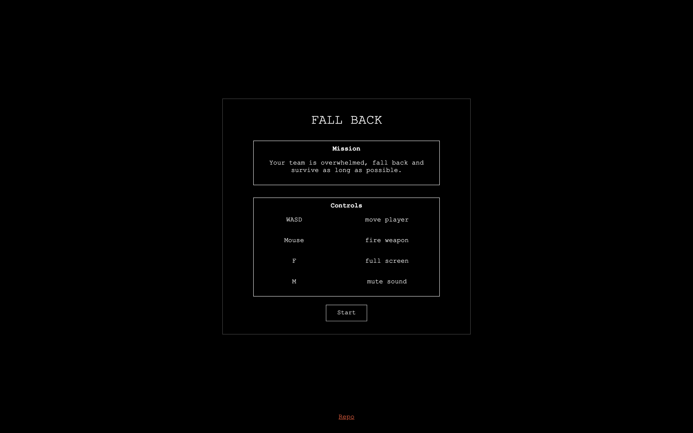
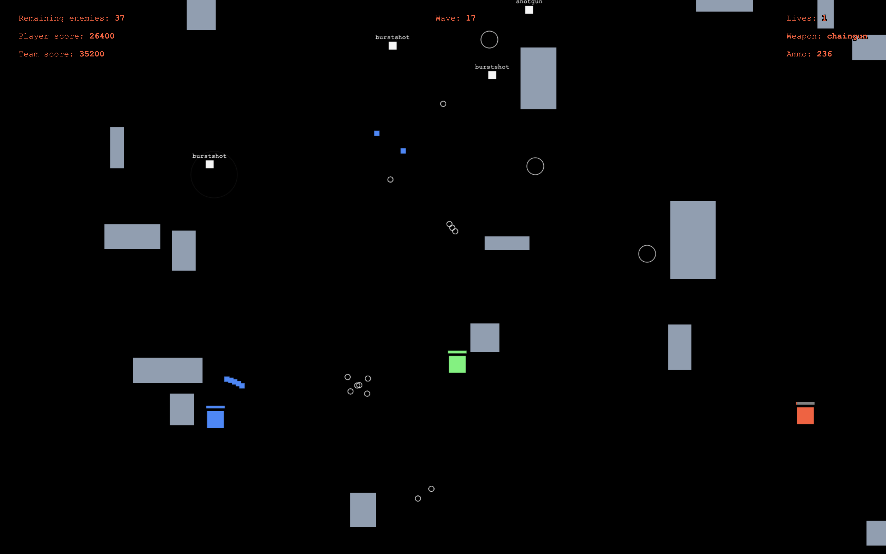

# Fall back

A simple multiplayer web game created for the [Js13kGames coding competition](https://js13kgames.com/). The entire game (code, assets, and storage) is under 13kB.

A live version can be found at [https://fall-back.herokuapp.com](https://fall-back.herokuapp.com) (this may take a a few moments to start up).

## Screenshots

## Running locally

From the root directory, install all dependencies:

    npm install

Build the app and start a local server at [http://localhost:3000](http://localhost:3000) with:

    npm serve

You can also use:

    npm run dev

which will watch all the files in `dev/` and automatically rebuild and restart the server. You can rebuild manually with:

    npm run build

Building minifies and zips all game assets and logs the remaining bytes available in the 13Kb limit.

## Authors

Built by [nasearle](https://github.com/nasearle) and [DavidScales](https://github.com/DavidScales)

Music: Synth 4k by m / Bits'n'Bites
